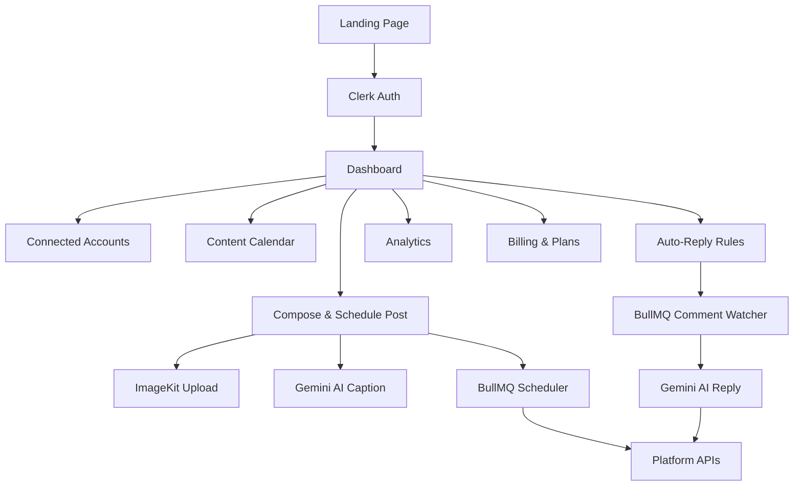
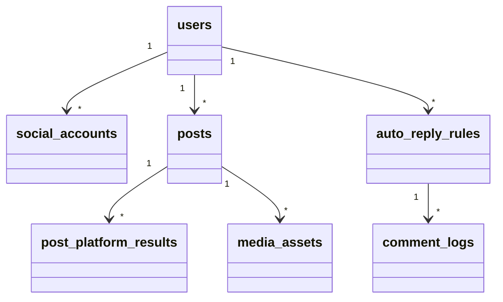
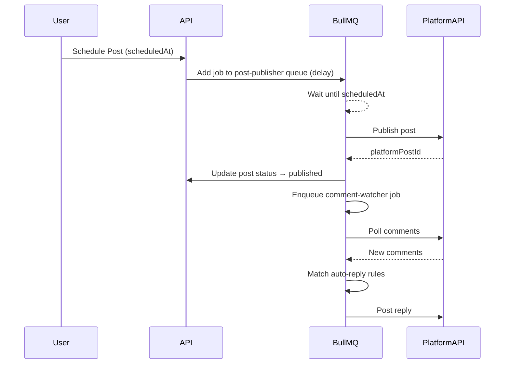

# Social Copilot — Master Product Specification

# Social Copilot — Master Product Specification

## 1. Product Overview

**Social Copilot** is a unified social media management platform that lets creators and teams connect all their social accounts, compose posts once, publish or schedule them across multiple platforms simultaneously, and automate comment engagement — all powered by AI.

### Core Value Propositions

- **One Compose, Many Platforms** — write once, publish everywhere
- **Smart Scheduling** — visual calendar with drag-and-drop rescheduling
- **AI-Powered Engagement** — auto-reply to comments based on keywords or AI context
- **Media Intelligence** — ImageKit-powered upload, transformation, and CDN delivery
- **Subscription Tiers** — Free → Pro → Agency with Clerk Billing

## 2. Tech Stack

| Layer | Technology |
| --- | --- |
| Framework | Next.js 16 (App Router), TypeScript |
| UI | ShadCN Component Library, Tailwind CSS v4 |
| Auth & Billing | Clerk (Auth + Billing / Subscriptions) |
| Database | NeonDB (Postgres) + DrizzleORM |
| File Storage & AI Transform | ImageKit |
| Background Jobs | BullMQ (Redis-backed) |
| AI Model | Google Gemini (via `@google/generative-ai`) |
| Social APIs | Platform OAuth SDKs (Meta, Google, TikTok, LinkedIn, Pinterest, Discord, Twitter/X, Slack) |

## 3. Application Architecture



## 4. Route Structure

```
app/
├── (landing)/
│   └── page.tsx                  ← Public landing page
├── (auth)/
│   ├── sign-in/[[...sign-in]]/
│   └── sign-up/[[...sign-up]]/
├── (dashboard)/
│   ├── layout.tsx                ← Sidebar + top nav shell
│   ├── dashboard/page.tsx        ← Overview / stats
│   ├── accounts/page.tsx         ← Connected social accounts
│   ├── compose/page.tsx          ← Post composer
│   ├── calendar/page.tsx         ← Scheduled posts calendar
│   ├── auto-reply/page.tsx       ← Auto-reply rules
│   ├── analytics/page.tsx        ← Engagement analytics
│   └── billing/page.tsx          ← Plans & subscription
├── api/
│   ├── webhooks/clerk/           ← Clerk user sync
│   ├── oauth/[platform]/         ← OAuth callback handlers
│   ├── posts/                    ← Post CRUD + publish
│   ├── schedule/                 ← BullMQ job management
│   ├── auto-reply/               ← Rule CRUD + trigger
│   ├── media/                    ← ImageKit signed upload
│   └── ai/                       ← Gemini caption/reply generation
```

## 5. Database Schema (DrizzleORM / NeonDB)

### Entities

| Table | Key Columns |
| --- | --- |
| `users` | `id`, `clerkId`, `email`, `plan`, `createdAt` |
| `social_accounts` | `id`, `userId`, `platform`, `accessToken`, `refreshToken`, `accountHandle`, `expiresAt` |
| `posts` | `id`, `userId`, `content`, `mediaUrls[]`, `platforms[]`, `status`, `scheduledAt`, `publishedAt` |
| `post_platform_results` | `id`, `postId`, `platform`, `platformPostId`, `status`, `error` |
| `auto_reply_rules` | `id`, `userId`, `platform`, `accountId`, `triggerType` (keyword/ai), `keywords[]`, `replyTemplate`, `aiPrompt`, `isActive` |
| `comment_logs` | `id`, `ruleId`, `commentId`, `commentText`, `replyText`, `repliedAt` |
| `media_assets` | `id`, `userId`, `imagekitFileId`, `url`, `type`, `size`, `createdAt` |



## 6. Supported Social Platforms

| Platform | Post | Schedule | Auto-Reply | OAuth Provider |
| --- | --- | --- | --- | --- |
| Instagram | ✅ | ✅ | ✅ | Meta Graph API |
| Facebook | ✅ | ✅ | ✅ | Meta Graph API |
| YouTube | ✅ | ✅ | ✅ | Google OAuth2 |
| TikTok | ✅ | ✅ | ❌ | TikTok Login Kit |
| LinkedIn | ✅ | ✅ | ✅ | LinkedIn OAuth2 |
| Pinterest | ✅ | ✅ | ❌ | Pinterest OAuth2 |
| Twitter / X | ✅ | ✅ | ✅ | Twitter OAuth2 |
| Discord | ✅ | ✅ | ✅ | Discord OAuth2 |
| Slack | ✅ | ✅ | ❌ | Slack OAuth2 |

## 7. Feature Specifications

### 7.1 Landing Page

A marketing-grade landing page with:

- **Hero** — headline, sub-headline, animated platform logos, CTA buttons (Get Started Free / View Demo)
- **Features Section** — 6-card grid with icons (Compose, Schedule, Auto-Reply, Analytics, AI, Multi-Platform)
- **How It Works** — 3-step visual flow
- **Pricing Section** — 3-tier cards (Free / Pro / Agency) with feature comparison table
- **Testimonials** — carousel of social proof
- **FAQ** — accordion
- **Footer** — links, social icons

### 7.2 Authentication

Clerk handles sign-up, sign-in, and session management. A Clerk webhook (`/api/webhooks/clerk`) syncs new users into the `users` NeonDB table on `user.created` events.

### 7.3 Dashboard Overview

Stats cards: Total Posts, Scheduled Posts, Connected Accounts, Engagement Rate. Recent activity feed. Quick-action buttons (New Post, Connect Account).

### 7.4 Connected Accounts

Grid of platform cards. Each shows: platform logo, connected handle, connection status, token expiry warning. Actions: Connect (OAuth flow), Disconnect, Reconnect. OAuth tokens stored encrypted in `social_accounts`.

### 7.5 Post Composer

- Rich text editor with character count per platform
- Platform selector (multi-select checkboxes with platform icons)
- Media uploader (drag-and-drop → ImageKit signed upload → preview grid)
- AI Caption Generator (Gemini) — "Generate Caption" button with tone selector
- Publish options: **Publish Now** or **Schedule** (date-time picker)
- Platform-specific preview panel (shows how post looks on each selected platform)

### 7.6 Content Calendar

- Full-month calendar view (react-day-picker or custom)
- Each day shows post thumbnails/dots
- Click a post → side panel with post details, status, edit/delete actions
- Drag-and-drop to reschedule (updates BullMQ job)
- Filter by platform, status (scheduled / published / failed)

### 7.7 Auto-Reply Rules

- Rule builder: select platform + account, choose trigger type
  - **Keyword trigger**: enter comma-separated keywords; reply template with `{username}` variable
  - **AI trigger**: enter a prompt; Gemini generates contextual reply
- Rules list with toggle (active/inactive), edit, delete
- Comment log table: shows matched comments and replies sent

### 7.8 Analytics

- Per-platform engagement charts (recharts): likes, comments, shares, reach
- Top performing posts table
- Date range picker
- Export CSV button

### 7.9 Billing & Plans

Clerk Billing integration. Three plans:

| Feature | Free | Pro ($19/mo) | Agency ($49/mo) |
| --- | --- | --- | --- |
| Connected Accounts | 3 | 10 | Unlimited |
| Scheduled Posts/mo | 30 | 500 | Unlimited |
| Auto-Reply Rules | 1 | 20 | Unlimited |
| AI Captions | 10/mo | 200/mo | Unlimited |
| Team Members | 1 | 3 | 10 |
| Analytics | Basic | Advanced | Advanced + Export |

Billing page shows current plan, usage meters, upgrade/downgrade CTA, invoice history.

## 8. Background Jobs (BullMQ)

### Queues

| Queue | Purpose |
| --- | --- |
| `post-publisher` | Executes scheduled posts at the right time via platform APIs |
| `comment-watcher` | Polls platform APIs for new comments on published posts |
| `auto-replier` | Processes matched comments, generates reply (AI or template), posts reply |
| `token-refresher` | Refreshes expiring OAuth tokens before they expire |



## 9. AI Integration (Gemini)

- **Caption Generation**: given topic/tone/platform, Gemini returns an optimized caption with hashtags
- **Auto-Reply Generation**: given comment text + post context + user prompt, Gemini returns a natural reply
- Rate-limited per plan tier; usage tracked in `users.aiUsageCount`

## 10. Media Handling (ImageKit)

- Client-side: request signed upload URL from `/api/media/sign`
- Upload directly to ImageKit from browser
- Store `imagekitFileId` + CDN URL in `media_assets`
- AI transformations: auto-crop, background removal, format conversion via ImageKit URL parameters

## 11. UI/UX Design Principles

- **Design System**: ShadCN + Tailwind v4 with a custom dark/light theme
- **Color Palette**: Deep navy primary, electric violet accent, clean whites/grays
- **Typography**: Inter (headings bold, body regular)
- **Motion**: Subtle fade/slide transitions, skeleton loaders
- **Responsive**: Mobile-first, sidebar collapses to bottom nav on mobile
- **Accessibility**: ARIA labels, keyboard navigation, focus rings

## 12. Landing Page Wireframe

```wireframe

<html>
<head>
<style>
  * { margin: 0; padding: 0; box-sizing: border-box; font-family: 'Inter', sans-serif; }
  body { background: #0a0a14; color: #fff; }
  nav { display: flex; justify-content: space-between; align-items: center; padding: 20px 60px; border-bottom: 1px solid #1e1e3a; }
  .logo { font-size: 22px; font-weight: 700; color: #a78bfa; }
  .nav-links { display: flex; gap: 28px; font-size: 14px; color: #94a3b8; }
  .nav-cta { display: flex; gap: 12px; }
  .btn-outline { padding: 8px 20px; border: 1px solid #a78bfa; border-radius: 8px; color: #a78bfa; font-size: 14px; cursor: pointer; background: transparent; }
  .btn-primary { padding: 8px 20px; background: #7c3aed; border-radius: 8px; color: #fff; font-size: 14px; cursor: pointer; border: none; }
  .hero { text-align: center; padding: 100px 60px 60px; }
  .hero-badge { display: inline-block; background: #1e1e3a; border: 1px solid #7c3aed; border-radius: 20px; padding: 6px 16px; font-size: 12px; color: #a78bfa; margin-bottom: 24px; }
  .hero h1 { font-size: 64px; font-weight: 800; line-height: 1.1; margin-bottom: 20px; background: linear-gradient(135deg, #fff 40%, #a78bfa); -webkit-background-clip: text; -webkit-text-fill-color: transparent; }
  .hero p { font-size: 18px; color: #94a3b8; max-width: 560px; margin: 0 auto 36px; }
  .hero-ctas { display: flex; gap: 16px; justify-content: center; }
  .btn-hero { padding: 14px 32px; background: #7c3aed; border-radius: 10px; color: #fff; font-size: 16px; font-weight: 600; border: none; cursor: pointer; }
  .btn-hero-outline { padding: 14px 32px; border: 1px solid #334155; border-radius: 10px; color: #94a3b8; font-size: 16px; background: transparent; cursor: pointer; }
  .platforms { display: flex; gap: 20px; justify-content: center; margin-top: 48px; flex-wrap: wrap; }
  .platform-pill { background: #1e1e3a; border: 1px solid #2d2d50; border-radius: 30px; padding: 8px 18px; font-size: 13px; color: #94a3b8; display: flex; align-items: center; gap: 8px; }
  .platform-dot { width: 8px; height: 8px; border-radius: 50%; background: #7c3aed; }
  .features { padding: 80px 60px; }
  .section-label { text-align: center; font-size: 13px; color: #7c3aed; font-weight: 600; letter-spacing: 2px; text-transform: uppercase; margin-bottom: 12px; }
  .section-title { text-align: center; font-size: 40px; font-weight: 700; margin-bottom: 48px; }
  .features-grid { display: grid; grid-template-columns: repeat(3, 1fr); gap: 24px; max-width: 1000px; margin: 0 auto; }
  .feature-card { background: #0f0f1e; border: 1px solid #1e1e3a; border-radius: 16px; padding: 28px; }
  .feature-icon { width: 44px; height: 44px; background: #1e1e3a; border-radius: 10px; margin-bottom: 16px; display: flex; align-items: center; justify-content: center; font-size: 20px; }
  .feature-card h3 { font-size: 16px; font-weight: 600; margin-bottom: 8px; }
  .feature-card p { font-size: 13px; color: #64748b; line-height: 1.6; }
  .pricing { padding: 80px 60px; background: #07070f; }
  .pricing-grid { display: grid; grid-template-columns: repeat(3, 1fr); gap: 24px; max-width: 900px; margin: 0 auto; }
  .price-card { background: #0f0f1e; border: 1px solid #1e1e3a; border-radius: 20px; padding: 32px; }
  .price-card.popular { border-color: #7c3aed; position: relative; }
  .popular-badge { position: absolute; top: -12px; left: 50%; transform: translateX(-50%); background: #7c3aed; border-radius: 20px; padding: 4px 16px; font-size: 12px; font-weight: 600; }
  .plan-name { font-size: 14px; color: #94a3b8; margin-bottom: 8px; }
  .plan-price { font-size: 42px; font-weight: 800; margin-bottom: 4px; }
  .plan-price span { font-size: 16px; font-weight: 400; color: #64748b; }
  .plan-desc { font-size: 13px; color: #64748b; margin-bottom: 24px; }
  .plan-features { list-style: none; margin-bottom: 28px; }
  .plan-features li { font-size: 13px; color: #94a3b8; padding: 6px 0; border-bottom: 1px solid #1e1e3a; display: flex; gap: 8px; }
  .check { color: #7c3aed; }
  .btn-plan { width: 100%; padding: 12px; border-radius: 10px; font-size: 14px; font-weight: 600; cursor: pointer; border: 1px solid #334155; background: transparent; color: #fff; }
  .btn-plan.primary { background: #7c3aed; border-color: #7c3aed; }
  footer { padding: 40px 60px; border-top: 1px solid #1e1e3a; display: flex; justify-content: space-between; align-items: center; }
  .footer-logo { font-size: 18px; font-weight: 700; color: #a78bfa; }
  .footer-links { display: flex; gap: 24px; font-size: 13px; color: #64748b; }
</style>
</head>
<body>
  <nav>
    <div class="logo">⚡ SocialCopilot</div>
    <div class="nav-links">
      <span>Features</span><span>Pricing</span><span>Blog</span><span>Docs</span>
    </div>
    <div class="nav-cta">
      <button class="btn-outline">Sign In</button>
      <button class="btn-primary">Get Started Free</button>
    </div>
  </nav>

  <section class="hero">
    <div class="hero-badge">✨ AI-Powered Social Media Management</div>
    <h1>Manage All Your Social<br/>Platforms in One Place</h1>
    <p>Create, schedule, and auto-engage across Instagram, YouTube, TikTok, LinkedIn, and 5 more — powered by Gemini AI.</p>
    <div class="hero-ctas">
      <button class="btn-hero">Start for Free →</button>
      <button class="btn-hero-outline">▶ Watch Demo</button>
    </div>
    <div class="platforms">
      <div class="platform-pill"><div class="platform-dot"></div>Instagram</div>
      <div class="platform-pill"><div class="platform-dot"></div>YouTube</div>
      <div class="platform-pill"><div class="platform-dot"></div>TikTok</div>
      <div class="platform-pill"><div class="platform-dot"></div>LinkedIn</div>
      <div class="platform-pill"><div class="platform-dot"></div>Twitter/X</div>
      <div class="platform-pill"><div class="platform-dot"></div>Facebook</div>
      <div class="platform-pill"><div class="platform-dot"></div>Pinterest</div>
      <div class="platform-pill"><div class="platform-dot"></div>Discord</div>
      <div class="platform-pill"><div class="platform-dot"></div>Slack</div>
    </div>
  </section>

  <section class="features">
    <div class="section-label">Features</div>
    <div class="section-title">Everything You Need to Grow</div>
    <div class="features-grid">
      <div class="feature-card"><div class="feature-icon">✍️</div><h3>Unified Composer</h3><p>Write once, publish to all platforms with platform-specific previews.</p></div>
      <div class="feature-card"><div class="feature-icon">📅</div><h3>Smart Scheduling</h3><p>Visual calendar with drag-and-drop rescheduling and optimal time suggestions.</p></div>
      <div class="feature-card"><div class="feature-icon">🤖</div><h3>AI Captions</h3><p>Gemini AI generates platform-optimized captions with hashtags in seconds.</p></div>
      <div class="feature-card"><div class="feature-icon">💬</div><h3>Auto-Reply</h3><p>Keyword or AI-based auto-replies keep your audience engaged 24/7.</p></div>
      <div class="feature-card"><div class="feature-icon">📊</div><h3>Analytics</h3><p>Track engagement, reach, and growth across all platforms in one dashboard.</p></div>
      <div class="feature-card"><div class="feature-icon">🖼️</div><h3>Media Hub</h3><p>Upload, transform, and manage all your media assets with ImageKit CDN.</p></div>
    </div>
  </section>

  <section class="pricing">
    <div class="section-label">Pricing</div>
    <div class="section-title">Simple, Transparent Pricing</div>
    <div class="pricing-grid">
      <div class="price-card">
        <div class="plan-name">FREE</div>
        <div class="plan-price">$0<span>/mo</span></div>
        <div class="plan-desc">Perfect for getting started</div>
        <ul class="plan-features">
          <li><span class="check">✓</span> 3 Connected Accounts</li>
          <li><span class="check">✓</span> 30 Scheduled Posts/mo</li>
          <li><span class="check">✓</span> 1 Auto-Reply Rule</li>
          <li><span class="check">✓</span> 10 AI Captions/mo</li>
          <li><span class="check">✓</span> Basic Analytics</li>
        </ul>
        <button class="btn-plan">Get Started Free</button>
      </div>
      <div class="price-card popular">
        <div class="popular-badge">Most Popular</div>
        <div class="plan-name">PRO</div>
        <div class="plan-price">$19<span>/mo</span></div>
        <div class="plan-desc">For serious creators</div>
        <ul class="plan-features">
          <li><span class="check">✓</span> 10 Connected Accounts</li>
          <li><span class="check">✓</span> 500 Scheduled Posts/mo</li>
          <li><span class="check">✓</span> 20 Auto-Reply Rules</li>
          <li><span class="check">✓</span> 200 AI Captions/mo</li>
          <li><span class="check">✓</span> Advanced Analytics</li>
        </ul>
        <button class="btn-plan primary">Upgrade to Pro</button>
      </div>
      <div class="price-card">
        <div class="plan-name">AGENCY</div>
        <div class="plan-price">$49<span>/mo</span></div>
        <div class="plan-desc">For teams & agencies</div>
        <ul class="plan-features">
          <li><span class="check">✓</span> Unlimited Accounts</li>
          <li><span class="check">✓</span> Unlimited Posts</li>
          <li><span class="check">✓</span> Unlimited Auto-Reply</li>
          <li><span class="check">✓</span> Unlimited AI Captions</li>
          <li><span class="check">✓</span> Analytics + CSV Export</li>
        </ul>
        <button class="btn-plan">Contact Sales</button>
      </div>
    </div>
  </section>

  <footer>
    <div class="footer-logo">⚡ SocialCopilot</div>
    <div class="footer-links">
      <span>Privacy</span><span>Terms</span><span>Support</span><span>Status</span>
    </div>
  </footer>
</body>
</html>
```

## 13. Dashboard Shell Wireframe

```wireframe

<html>
<head>
<style>
  * { margin: 0; padding: 0; box-sizing: border-box; font-family: 'Inter', sans-serif; }
  body { background: #0a0a14; color: #fff; display: flex; height: 100vh; overflow: hidden; }
  .sidebar { width: 240px; background: #0f0f1e; border-right: 1px solid #1e1e3a; display: flex; flex-direction: column; padding: 20px 0; flex-shrink: 0; }
  .sidebar-logo { padding: 0 20px 24px; font-size: 18px; font-weight: 700; color: #a78bfa; border-bottom: 1px solid #1e1e3a; }
  .sidebar-section { padding: 16px 12px 8px; font-size: 10px; color: #475569; letter-spacing: 1.5px; text-transform: uppercase; }
  .sidebar-item { display: flex; align-items: center; gap: 10px; padding: 10px 20px; font-size: 14px; color: #94a3b8; cursor: pointer; border-radius: 8px; margin: 2px 8px; }
  .sidebar-item.active { background: #1e1e3a; color: #a78bfa; }
  .sidebar-item:hover { background: #1a1a2e; }
  .sidebar-icon { font-size: 16px; }
  .sidebar-bottom { margin-top: auto; padding: 16px; border-top: 1px solid #1e1e3a; }
  .user-pill { display: flex; align-items: center; gap: 10px; padding: 10px; background: #1e1e3a; border-radius: 10px; }
  .avatar { width: 32px; height: 32px; background: #7c3aed; border-radius: 50%; display: flex; align-items: center; justify-content: center; font-size: 13px; font-weight: 600; }
  .user-info { flex: 1; }
  .user-name { font-size: 13px; font-weight: 600; }
  .user-plan { font-size: 11px; color: #7c3aed; }
  .main { flex: 1; display: flex; flex-direction: column; overflow: hidden; }
  .topbar { padding: 16px 28px; border-bottom: 1px solid #1e1e3a; display: flex; justify-content: space-between; align-items: center; }
  .topbar-title { font-size: 20px; font-weight: 700; }
  .topbar-actions { display: flex; gap: 12px; }
  .btn-sm { padding: 8px 16px; background: #7c3aed; border-radius: 8px; font-size: 13px; font-weight: 600; border: none; color: #fff; cursor: pointer; }
  .content { flex: 1; overflow-y: auto; padding: 28px; }
  .stats-grid { display: grid; grid-template-columns: repeat(4, 1fr); gap: 16px; margin-bottom: 28px; }
  .stat-card { background: #0f0f1e; border: 1px solid #1e1e3a; border-radius: 14px; padding: 20px; }
  .stat-label { font-size: 12px; color: #64748b; margin-bottom: 8px; }
  .stat-value { font-size: 32px; font-weight: 700; }
  .stat-change { font-size: 12px; color: #22c55e; margin-top: 4px; }
  .two-col { display: grid; grid-template-columns: 2fr 1fr; gap: 20px; }
  .panel { background: #0f0f1e; border: 1px solid #1e1e3a; border-radius: 14px; padding: 20px; }
  .panel-title { font-size: 15px; font-weight: 600; margin-bottom: 16px; }
  .post-row { display: flex; align-items: center; gap: 12px; padding: 10px 0; border-bottom: 1px solid #1e1e3a; }
  .post-thumb { width: 40px; height: 40px; background: #1e1e3a; border-radius: 8px; }
  .post-info { flex: 1; }
  .post-title { font-size: 13px; font-weight: 500; }
  .post-meta { font-size: 11px; color: #64748b; margin-top: 2px; }
  .badge { display: inline-block; padding: 2px 8px; border-radius: 20px; font-size: 11px; }
  .badge-scheduled { background: #1e3a5f; color: #60a5fa; }
  .badge-published { background: #14532d; color: #4ade80; }
  .badge-failed { background: #450a0a; color: #f87171; }
  .account-list { display: flex; flex-direction: column; gap: 10px; }
  .account-row { display: flex; align-items: center; gap: 10px; padding: 10px; background: #1a1a2e; border-radius: 10px; }
  .platform-icon { width: 32px; height: 32px; background: #1e1e3a; border-radius: 8px; display: flex; align-items: center; justify-content: center; font-size: 16px; }
  .account-name { font-size: 13px; font-weight: 500; flex: 1; }
  .status-dot { width: 8px; height: 8px; border-radius: 50%; background: #22c55e; }
</style>
</head>
<body>
  <aside class="sidebar">
    <div class="sidebar-logo">⚡ SocialCopilot</div>
    <div class="sidebar-section">Main</div>
    <div class="sidebar-item active"><span class="sidebar-icon">📊</span> Dashboard</div>
    <div class="sidebar-item"><span class="sidebar-icon">🔗</span> Accounts</div>
    <div class="sidebar-item"><span class="sidebar-icon">✍️</span> Compose</div>
    <div class="sidebar-item"><span class="sidebar-icon">📅</span> Calendar</div>
    <div class="sidebar-section">Automation</div>
    <div class="sidebar-item"><span class="sidebar-icon">💬</span> Auto-Reply</div>
    <div class="sidebar-item"><span class="sidebar-icon">📈</span> Analytics</div>
    <div class="sidebar-section">Account</div>
    <div class="sidebar-item"><span class="sidebar-icon">💳</span> Billing</div>
    <div class="sidebar-item"><span class="sidebar-icon">⚙️</span> Settings</div>
    <div class="sidebar-bottom">
      <div class="user-pill">
        <div class="avatar">RR</div>
        <div class="user-info">
          <div class="user-name">Rohit Rawat</div>
          <div class="user-plan">Pro Plan</div>
        </div>
      </div>
    </div>
  </aside>

  <main class="main">
    <div class="topbar">
      <div class="topbar-title">Dashboard</div>
      <div class="topbar-actions">
        <button class="btn-sm">+ New Post</button>
      </div>
    </div>
    <div class="content">
      <div class="stats-grid">
        <div class="stat-card"><div class="stat-label">Total Posts</div><div class="stat-value">142</div><div class="stat-change">↑ 12% this week</div></div>
        <div class="stat-card"><div class="stat-label">Scheduled</div><div class="stat-value">18</div><div class="stat-change">↑ 3 new today</div></div>
        <div class="stat-card"><div class="stat-label">Connected Accounts</div><div class="stat-value">7</div><div class="stat-change">↑ 1 added</div></div>
        <div class="stat-card"><div class="stat-label">Engagement Rate</div><div class="stat-value">4.8%</div><div class="stat-change">↑ 0.3% vs last week</div></div>
      </div>
      <div class="two-col">
        <div class="panel">
          <div class="panel-title">Recent Posts</div>
          <div class="post-row"><div class="post-thumb"></div><div class="post-info"><div class="post-title">New product launch announcement 🚀</div><div class="post-meta">Instagram, LinkedIn · 2h ago</div></div><span class="badge badge-published">Published</span></div>
          <div class="post-row"><div class="post-thumb"></div><div class="post-info"><div class="post-title">Behind the scenes video drop</div><div class="post-meta">YouTube, TikTok · Tomorrow 9am</div></div><span class="badge badge-scheduled">Scheduled</span></div>
          <div class="post-row"><div class="post-thumb"></div><div class="post-info"><div class="post-title">Weekly tips thread</div><div class="post-meta">Twitter/X · Yesterday</div></div><span class="badge badge-published">Published</span></div>
          <div class="post-row"><div class="post-thumb"></div><div class="post-info"><div class="post-title">Community update post</div><div class="post-meta">Discord, Slack · Failed</div></div><span class="badge badge-failed">Failed</span></div>
        </div>
        <div class="panel">
          <div class="panel-title">Connected Accounts</div>
          <div class="account-list">
            <div class="account-row"><div class="platform-icon">📸</div><div class="account-name">@rohit.creates</div><div class="status-dot"></div></div>
            <div class="account-row"><div class="platform-icon">▶️</div><div class="account-name">Rohit Rawat YT</div><div class="status-dot"></div></div>
            <div class="account-row"><div class="platform-icon">🎵</div><div class="account-name">@rohitrawat</div><div class="status-dot"></div></div>
            <div class="account-row"><div class="platform-icon">💼</div><div class="account-name">Rohit Rawat</div><div class="status-dot"></div></div>
            <div class="account-row"><div class="platform-icon">🐦</div><div class="account-name">@rohit_dev</div><div class="status-dot"></div></div>
          </div>
        </div>
      </div>
    </div>
  </main>
</body>
</html>
```

## 14. Post Composer Wireframe

```wireframe

<html>
<head>
<style>
  * { margin: 0; padding: 0; box-sizing: border-box; font-family: 'Inter', sans-serif; }
  body { background: #0a0a14; color: #fff; padding: 28px; }
  .composer-layout { display: grid; grid-template-columns: 1fr 340px; gap: 24px; max-width: 1100px; margin: 0 auto; }
  .panel { background: #0f0f1e; border: 1px solid #1e1e3a; border-radius: 16px; padding: 24px; }
  .panel-title { font-size: 16px; font-weight: 700; margin-bottom: 20px; }
  .section-label { font-size: 12px; color: #64748b; font-weight: 600; text-transform: uppercase; letter-spacing: 1px; margin-bottom: 10px; }
  .platform-grid { display: flex; flex-wrap: wrap; gap: 10px; margin-bottom: 24px; }
  .platform-chip { display: flex; align-items: center; gap: 6px; padding: 8px 14px; border: 1px solid #1e1e3a; border-radius: 30px; font-size: 13px; color: #94a3b8; cursor: pointer; }
  .platform-chip.selected { border-color: #7c3aed; background: #1e1e3a; color: #a78bfa; }
  .editor-area { background: #1a1a2e; border: 1px solid #1e1e3a; border-radius: 12px; padding: 16px; min-height: 160px; font-size: 14px; color: #e2e8f0; line-height: 1.7; margin-bottom: 8px; outline: none; }
  .char-count { font-size: 12px; color: #475569; text-align: right; margin-bottom: 20px; }
  .ai-bar { display: flex; gap: 10px; align-items: center; margin-bottom: 24px; }
  .ai-input { flex: 1; background: #1a1a2e; border: 1px solid #1e1e3a; border-radius: 8px; padding: 10px 14px; font-size: 13px; color: #e2e8f0; outline: none; }
  .btn-ai { padding: 10px 18px; background: linear-gradient(135deg, #7c3aed, #a855f7); border-radius: 8px; font-size: 13px; font-weight: 600; border: none; color: #fff; cursor: pointer; white-space: nowrap; }
  .media-zone { border: 2px dashed #1e1e3a; border-radius: 12px; padding: 32px; text-align: center; margin-bottom: 24px; cursor: pointer; }
  .media-zone-icon { font-size: 28px; margin-bottom: 8px; }
  .media-zone p { font-size: 13px; color: #64748b; }
  .media-zone span { font-size: 12px; color: #475569; }
  .schedule-row { display: flex; gap: 12px; align-items: center; margin-bottom: 24px; }
  .toggle-group { display: flex; background: #1a1a2e; border-radius: 8px; padding: 4px; }
  .toggle-btn { padding: 8px 16px; border-radius: 6px; font-size: 13px; border: none; background: transparent; color: #64748b; cursor: pointer; }
  .toggle-btn.active { background: #7c3aed; color: #fff; }
  .datetime-input { flex: 1; background: #1a1a2e; border: 1px solid #1e1e3a; border-radius: 8px; padding: 10px 14px; font-size: 13px; color: #e2e8f0; }
  .action-row { display: flex; gap: 12px; }
  .btn-draft { flex: 1; padding: 12px; border: 1px solid #334155; border-radius: 10px; background: transparent; color: #94a3b8; font-size: 14px; font-weight: 600; cursor: pointer; }
  .btn-publish { flex: 2; padding: 12px; background: #7c3aed; border-radius: 10px; font-size: 14px; font-weight: 600; border: none; color: #fff; cursor: pointer; }
  .preview-panel { display: flex; flex-direction: column; gap: 16px; }
  .preview-card { background: #1a1a2e; border: 1px solid #1e1e3a; border-radius: 12px; padding: 16px; }
  .preview-header { display: flex; align-items: center; gap: 8px; margin-bottom: 12px; }
  .preview-avatar { width: 32px; height: 32px; background: #7c3aed; border-radius: 50%; }
  .preview-name { font-size: 13px; font-weight: 600; }
  .preview-handle { font-size: 11px; color: #64748b; }
  .preview-content { font-size: 13px; color: #94a3b8; line-height: 1.6; }
  .preview-platform-label { font-size: 11px; color: #7c3aed; font-weight: 600; margin-bottom: 8px; }
  .preview-image { width: 100%; height: 120px; background: #1e1e3a; border-radius: 8px; margin-top: 10px; display: flex; align-items: center; justify-content: center; color: #475569; font-size: 12px; }
</style>
</head>
<body>
  <div style="font-size:20px;font-weight:700;margin-bottom:24px;">✍️ Compose Post</div>
  <div class="composer-layout">
    <div class="panel">
      <div class="section-label">Select Platforms</div>
      <div class="platform-grid">
        <div class="platform-chip selected">📸 Instagram</div>
        <div class="platform-chip selected">💼 LinkedIn</div>
        <div class="platform-chip">▶️ YouTube</div>
        <div class="platform-chip">🎵 TikTok</div>
        <div class="platform-chip selected">🐦 Twitter/X</div>
        <div class="platform-chip">👍 Facebook</div>
        <div class="platform-chip">📌 Pinterest</div>
        <div class="platform-chip">💬 Discord</div>
        <div class="platform-chip">💼 Slack</div>
      </div>

      <div class="section-label">Caption</div>
      <div class="editor-area" contenteditable="true">Excited to share our latest product update! 🚀 We've been working hard on this and can't wait for you to try it. Drop a comment below with your thoughts! #ProductLaunch #Innovation</div>
      <div class="char-count">187 / 2200 characters</div>

      <div class="section-label">AI Caption Generator</div>
      <div class="ai-bar">
        <input class="ai-input" placeholder="Describe your post topic or paste a URL..." />
        <button class="btn-ai">✨ Generate</button>
      </div>

      <div class="section-label">Media</div>
      <div class="media-zone">
        <div class="media-zone-icon">🖼️</div>
        <p>Drag & drop images or videos here</p>
        <span>PNG, JPG, MP4 · Max 100MB</span>
      </div>

      <div class="section-label">Publish Options</div>
      <div class="schedule-row">
        <div class="toggle-group">
          <button class="toggle-btn">Publish Now</button>
          <button class="toggle-btn active">Schedule</button>
        </div>
        <input class="datetime-input" type="text" value="Jun 15, 2025 · 9:00 AM" />
      </div>

      <div class="action-row">
        <button class="btn-draft">Save Draft</button>
        <button class="btn-publish">📅 Schedule Post</button>
      </div>
    </div>

    <div class="preview-panel">
      <div style="font-size:14px;font-weight:600;color:#64748b;">Live Preview</div>
      <div class="preview-card">
        <div class="preview-platform-label">📸 Instagram</div>
        <div class="preview-header">
          <div class="preview-avatar"></div>
          <div><div class="preview-name">rohit.creates</div><div class="preview-handle">@rohit.creates</div></div>
        </div>
        <div class="preview-image">[ Media Preview ]</div>
        <div class="preview-content" style="margin-top:10px;">Excited to share our latest product update! 🚀 #ProductLaunch #Innovation</div>
      </div>
      <div class="preview-card">
        <div class="preview-platform-label">💼 LinkedIn</div>
        <div class="preview-header">
          <div class="preview-avatar"></div>
          <div><div class="preview-name">Rohit Rawat</div><div class="preview-handle">Software Developer</div></div>
        </div>
        <div class="preview-content">Excited to share our latest product update! 🚀 We've been working hard on this and can't wait for you to try it. Drop a comment below with your thoughts! #ProductLaunch #Innovation</div>
      </div>
      <div class="preview-card">
        <div class="preview-platform-label">🐦 Twitter/X</div>
        <div class="preview-header">
          <div class="preview-avatar"></div>
          <div><div class="preview-name">Rohit Rawat</div><div class="preview-handle">@rohit_dev</div></div>
        </div>
        <div class="preview-content">Excited to share our latest product update! 🚀 Drop a comment below! #ProductLaunch</div>
      </div>
    </div>
  </div>
</body>
</html>
```